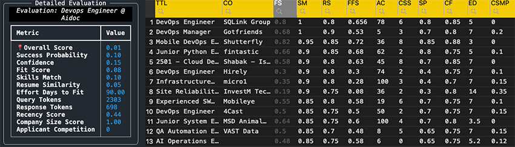

## JOBFUQ: Jackpot Opportunity Bot for Fixing Unemployment Quick



Sick of tweaking your resume just to get ghosted? **JOBFUQ** is your AI-powered, stealth-mode, LinkedIn-scraping savior, finding jobs that actually deserve your time.  
No more endless scrolling—**JOBFUQ** has your back, even if your career’s been as thrilling as flipping penguins (or mops). Whether you're a sysadmin faking DevOps or an aspiring IT pro, **JOBFUQ** adapts.

And if you’ve ever been *too* honest on your resume... brace yourself. 😏


---
### Why JOBFUQ?
- **Cuts through job board noise like a Ninja!** 🔍
- **Ranks job opportunities based on real AI insights (not just keyword matching)** 🤖
- **Filters out irrelevant jobs and penalizes those that don’t match your goals**
- **Brutally honest feedback on your fit and tells you exactly what to improve** 🎯
- **Saves time & effort** ⏳

**Note:** This project is in early development. It already works, but setup isn’t trivial. We plan to simplify it with time.

---
### 🚀 Quickstart

 **1️⃣ Clone & Install Dependencies**  
```bash
git clone https://github.com/chernistry/jobfuq.git
cd jobfuq
python3 -m venv venv
source venv/bin/activate  # (Windows: venv\Scripts\activate)
pip install -r requirements.txt
playwright install
```

 **2️⃣ Configure `jobfuq/config.json`**  
- **linkedin_credentials** → Enter LinkedIn login.

🚨Tip: **DO NOT use your personal LinkedIn account**. If you do, **you’re doing so at your own risk.** 🚨

- **search_queries** → Define job roles (keywords) & locations.  
- **provider_mode** → `"together"`, `"openrouter"`, or `"multi"`.  
- **prompt** → Path to your custom career prompt file.

 **3️⃣ Adapt the Prompt**  
- Edit `jobfuq/prompts/deepseek_r1_career_advisor_template.txt`.  
- Add your **background, experience, and skills**.  
- ❗ **Be honest** → AI predicts hiring chances based on facts. ❗  
- **Remove `<think>` sections** for models without CoT support.  
- Update `"prompt"` in config to **point to your file**.

**4️⃣ Run JOBFUQ**
- **Scrape & Process Together (Recommended):**
```bash
python -m jobfuq.scraper --recipe "scrap,process" --verbose [--hours <num>]
```
- `--hours <num>`: Filter jobs by their posting time. Only jobs posted within the last `<num>` hours will be scraped.  
  Example: `--hours 24` to scrape jobs posted in the last 24 hours.


- **OR Run separately:**

```bash
python -m jobfuq.scraper [--manual-login] [--debug-single] [--endless] [--verbose] [--hours <num>]
python -m jobfuq.processor [config_path] [resume_path] [--verbose] [--endless] [--threads <num>]
```

 **5️⃣ Inspect Results**  
- JOBFUQ saves jobs in `data/job_listings.db`.  
- Use **SQLite GUI tools** to browse/query.

---

#### 💰 AI Costs & Free Options
 **Free Use (OpenRouter)**  
- **20 req/hr, 200 req/day** → Watch rate limits!  
- Need more? Upgrade API plan. (💡*Together.ai gives free sign up credits!* 🎉)

 **💡 Model Pricing (Per Million Tokens)**

| Provider     | Model                                      | Cost  | Speed | Quality  |
|-------------|------------------------------------------|------|-----|---------|
| **Together** | `Meta-Llama-3.1-405B-Instruct-Turbo`  | ~$3.50  | ⚡⚡  | ⭐⭐⭐⭐  |
| **Together** | `Llama-3.3-70B-Instruct-Turbo`       | ~$0.88  | ⚡⚡⚡ | ⭐⭐⭐   |
| **Together** | `DeepSeek-R1`                        | ~$7.00  | ⚡   | ⭐⭐⭐⭐⭐ |
| **OpenRouter (Free)** | `deepseek/deepseek-r1:free`  | $0.00  | ⚡   | ⭐⭐⭐⭐   |
| **OpenRouter (Free)** | More on OpenRouter site     | $0.00  | Varies | Varies |

---

#### 🛠️ SQLite GUI Tools

| Tool | Platform | Links |
|------|----------|-------|
| **DB Browser for SQLite** | Win, Mac, Linux | [GitHub](https://github.com/sqlitebrowser/sqlitebrowser) / [Website](https://sqlitebrowser.org/) |
| **Beekeeper Studio** | Win, Mac, Linux | [GitHub](https://github.com/beekeeper-studio/beekeeper-studio) / [Website](https://www.beekeeperstudio.io/) |
| **SQLiteStudio** | Win, Mac, Linux | [GitHub](https://github.com/pawelsalawa/sqlitestudio) / [Website](https://sqlitestudio.pl/) |
| **DBeaver** | Win, Mac, Linux | [GitHub](https://github.com/dbeaver/dbeaver) / [Website](https://dbeaver.io/) |
| **SQLite Expert** | Windows | [Website](https://www.sqliteexpert.com/) |
| **Ducklet** | Mac | [Website](https://ducklet.app/) |
| **CuteSqlite** | Windows | [GitHub](https://github.com/shinehanx/CuteSqlite) / [Website](https://github.com/shinehanx/CuteSqlite) |
| **wxSQLitePlus** | Win, Mac, Linux | [GitHub](https://github.com/guanlisheng/wxsqliteplus) / [Website](https://github.com/guanlisheng/wxsqliteplus) |
| **DataGrip** | Win, Mac, Linux | [Website](https://www.jetbrains.com/datagrip/) |


---

### Prompt Preparation & “DeepSeek R1” Templates

- Check out `jobfuq/prompts/deepseek_r1_career_advisor_template.txt` for a generic starting prompt.
- For a QA Automation example, see `jobfuq/prompts/deepseek_r1_career_advisor_qa_auto_engineer.txt`.
- Customize these prompts (using ChatGPT or manually) to match your career background, skills, and experience.
- Update your config's `"prompt"` field to point to your new prompt file, e.g.:

 ```json
 "prompt": "prompts/my_custom_career_prompt.txt"
 ```
 
---
### ⚙️ Config Cheat Sheet

 **📂 Example: `jobfuq/config_example.json`**
```json
{
  "concurrent_details": 3,
  "user_agents": [ ... ],
  "search_queries": [{ "keywords": "Example Job", "location": "Somewhere", "f_WT": "1" }],
  "linkedin_credentials": { "1": { "username": "user@example.com", "password": "YOUR_PASSWORD_HERE" }},
  "provider_mode": "together",
  ...
  "prompt": "prompts/deepseek_r1_career_advisor_penguin_flipper.txt"
}
```

 **🛠️ Key Settings (What to Change)**
- `concurrent_details` → How many job pages scrape at once.  
- `user_agents` → Browser signatures to avoid detection.  
- `search_queries` → What jobs (keywords) & where (location).  
- `linkedin_credentials` → One or more LinkedIn logins (randomly picked if multiple).  
- `provider_mode` → AI provider: `"together"`, `"openrouter"`, or `"multi"`.  
- `<provider>_api_key`, `<provider>_model` → API keys & models.  
- `prompt` → Path to your custom job-matching prompt.

 **🔧 Advanced Options (Optional)**
- `"time_filter"`, `"max_postings"`, and more—fine-tune scraping behavior.

---

### 📊 Understanding the Results

 Every job in `job_listings` has key scores to help you decide:  
- **final_score** → Overall job fit ranking (main metric).  
- **skills_match** → 0–1 score; how well your skills match the job.  
- **resume_similarity** → 0–1 score; how similar your experience is.  
- **final_fit_score** → LLM-based assessment factoring in penalties.  
- **success_probability** → Estimated hire chance based on skills.  
- **effort_days_to_fit** → Days needed to fill skill gaps.  
- **critical_skill_mismatch_penalty** → Higher value = bigger gaps.

 **🖥️ Example: Get the Best Jobs**
```sql
WITH
-- 📌 JOB CLASSIFICATION: Categorizes jobs into 'TOP' and 'GOOD' clusters  
-- 🎯 'TOP' jobs have strong skill match (SK ≥ 0.70), high confidence (CF ≥ 0.70), minimal skill mismatch (PN ≤ 0.25), and quick adaptability (EF ≤ 12 days).  
-- 🎯 'GOOD' jobs have decent skill match (SK ≥ 0.60), moderate confidence (CF ≥ 0.60), slightly higher mismatch tolerance (PN ≤ 0.30), and longer adaptation (EF ≤ 30 days).  
JOBS AS (
    SELECT CASE
               WHEN skills_match >= 0.70 AND critical_skill_mismatch_penalty <= 0.25
                   AND confidence >= 0.70 AND success_probability >= 0.65
                   AND effort_days_to_fit <= 12 THEN 'TOP'
               WHEN skills_match >= 0.60 AND confidence >= 0.60
                   AND success_probability >= 0.59 AND critical_skill_mismatch_penalty <= 0.30
                   AND effort_days_to_fit <= 30 THEN 'GOOD'
               ELSE NULL
               END AS CL, *
    FROM main.job_listings
    WHERE is_posted = 1
),
-- 📌 FILTER JOBS: Remove unwanted titles based on blacklist/whitelist rules  
-- 🔍 Jobs are excluded if their title matches the blacklist and is not whitelisted  
FILTERED_JOBS AS (
    SELECT DISTINCT CL, id, application_status AS ST, company AS CP, title AS TT, date AS DT,
                    ROUND(final_score, 2) AS FS, skills_match AS SK, resume_similarity AS RS,
                    final_fit_score AS FT, applicants_count AS AP, company_size_score AS SZ,
                    success_probability AS PR, confidence AS CF, effort_days_to_fit AS EF,
                    critical_skill_mismatch_penalty AS PN
    FROM JOBS
    WHERE CL IS NOT NULL
      AND NOT EXISTS (
        SELECT 1 FROM blacklist bl
        WHERE bl.type = 'blacklist' AND LOWER(JOBS.title) LIKE '%' || LOWER(bl.value) || '%'
          AND NOT EXISTS (
            SELECT 1 FROM blacklist wl
            WHERE wl.type = 'whitelist' AND LOWER(JOBS.title) LIKE '%' || LOWER(wl.value) || '%'
        )
    )
)
-- 📌 FINAL SELECTION: Merge clusters while ensuring no duplicates  
-- 📈 Orders jobs by priority (TOP first), then by skill match, confidence, and success probability  
SELECT * FROM FILTERED_JOBS
WHERE CL = 'TOP' OR id NOT IN (SELECT id FROM FILTERED_JOBS WHERE CL = 'TOP')
ORDER BY CASE CL WHEN 'TOP' THEN 1 ELSE 2 END, SK DESC, CF DESC, PR DESC;

```


 **🚫 Filtering Out Bad Jobs**
- Add unwanted job terms to the **blacklist**, so they won’t show up.  
- **Whitelist overrides blacklist** (if a job is in both, it stays).

 **Example: Block Part-Time Jobs**
```sql
INSERT OR IGNORE INTO blacklist (value, type) VALUES ('Part-time', 'blacklist');
```

### Troubleshooting

| **Problem**            | **Fix It Like a Pro**                                                       |
 |------------------------|-----------------------------------------------------------------------------|
| Playwright Errors      | Double-check your installation and network connectivity.                    |
| Login Failures         | Verify your credentials in `config.json` or use `--manual-login`.            |
| AI Provider Issues     | Ensure your API keys are valid and review rate limits if issues arise.         |
| Timeouts/Skips         | Increase timeouts or run with `--verbose` to debug the issue.                 |
| Database Lock          | Make sure `data/job_listings.db` isn’t open in another application.           |
 
---

#### To-Do List

- [ ] Move selectors to YAML/TOML (avoid hardcoded values).
- [ ] Expand job site integration (e.g., Indeed, Glassdoor).
- [ ] Implement Hybrid API + Adaptive Scraping (future possibility).
- [ ] Dockerization for a one-command setup.
- [ ] Develop a UI to simplify orchestration and database inspection.

 ---

#### 🤝 Contribute  
- **Fork** → `git checkout -b feature/your-idea` → **Commit & Push** → PR 🚀
- **CC BY-NC 4.0e** — Free for all (even penguin flippers), but no profit, fam. 🚫💰
- ❓ Need Help? **GitHub Issues** or [sanderchernitsky@gmail.com](mailto:sanderchernitsky@gmail.com)

 ---

Now go get a job, you lazy bum! 🚀
