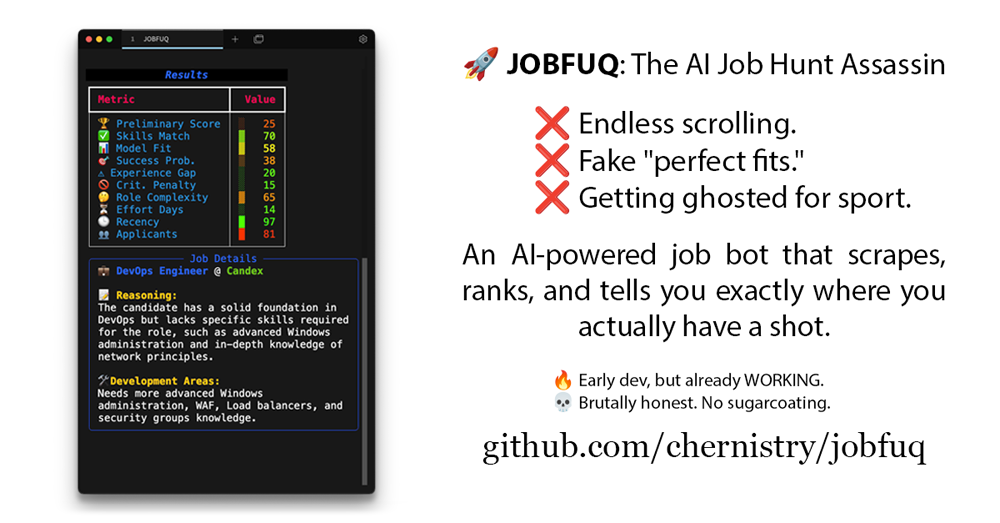

# JOBFUQ: Jackpot Opportunity Bot for Fixing Unemployment Quick



Tired of tailoring your CV just to be ghosted faster than a bad Tinder date? **JOBFUQ** is your AI-powered, LinkedIn-scraping, career-saving chaos agent—finding jobs that might actually deserve you (because rejection should at least come with effort).
No more doomscrolling through listings that require ten years of experience in a four-year-old framework. **JOBFUQ** adapts to your career missteps, your inflated skills, and even your creative interpretations of “team player.”
And if you’ve ever been too honest on your resume? Yeah, **JOBFUQ** saw that. And it’s judging you.

---

## Why JOBFUQ?

- **Cuts through job board noise like HR cuts budgets!** ✂️💸
- **AI-powered job scoring** that goes beyond boring keyword matching. 🎯🤖
- **Real-time scraping** from LinkedIn with stealth and advanced evasion techniques. 🕵️‍♂️🔍
- **Reality-check feedback** on your skills, gaps, and why you might still be unemployable. 📉💀
- **Database-backed storage** for those who love data but hate rejection. 🗄️📊
- **Dynamic rate limiting** so you don’t get banned before you even get ignored. 🚦🙈

> **Note:** **JOBFUQ** works (mostly). Setup experience inspired by Kafka, but with swearing. Now with smarter scoring — mind the skill gaps. 🧠⚠️
---

## Updated Features & Architecture Overview

### Project Structure

The project now sports a cleaner, modular layout:

```
.
├── data                     # SQLite databases (e.g., job_listings.db)
├── docker                   # Docker configurations (coming soon!)
└── jobfuq
    ├── conf                 # Configuration files (config.toml, linked_config.toml, SQL examples)
    ├── models               # AI provider integrations (openrouter.py, together.py)
    ├── prompts              # Prompt templates for career advice
    ├── sql                  # SQL queries for DB schema & operations
    ├── __init__.py          # Package initializer
    ├── database.py          # Database connection & table creation logic
    ├── linked_utils.py      # LinkedIn scraping utility functions
    ├── llm_handler.py       # AI integration & evaluation handler
    ├── logger.py            # Logging setup and utilities
    ├── processor.py         # Scoring engine & result display (with snarky ASCII gradients)
    ├── scraper.py           # Core LinkedIn scraping engine
    └── utils.py             # Helper functions (e.g., config loading)
```

### What’s New?

- **Updated Configuration:** The main config file (`jobfuq/conf/config.toml`) now includes settings such as `time_filter`, `concurrent_details`, `max_postings`, `retry_delay`, and `headless` mode.
- **LinkedIn Scraping Enhancements:** With refined selectors in `jobfuq/conf/linked_config.toml` and improved stealth techniques (randomized mouse physics, dynamic viewport resizing, fake HTTP traffic, etc.).
- **Database Schema Overhaul:** New SQL files in `jobfuq/sql` include:
  - `create_blacklist_table.sql`
  - `create_blacklisted_companies_table.sql`
  - `create_job_listings_table.sql`
  - `update_job_scores.sql`
  - And more!
- **AI Provider Integration:** Choose between **Together.ai** and **OpenRouter** or run both in multi-provider mode. Configuration options reside in the `[ai_providers]` section.
- **Enhanced Scoring Engine:** The scoring formula (in `jobfuq/processor.py`) now factors in recency, company size, and a slew of AI-evaluated metrics.
- **Robust Error Handling & Retry Logic:** With rate-limit updates and manual captcha handling built into `jobfuq/linked_utils.py`.

---

## 🚀 Quickstart

### 1️⃣ Clone & Install Dependencies

```bash
git clone https://github.com/chernistry/jobfuq.git
cd jobfuq
python3 -m venv venv
source venv/bin/activate  # (Windows: venv\Scripts\activate)
pip install -r requirements.txt
playwright install
```

### 2️⃣ Configure `jobfuq/conf/config.toml`

Edit this file to set up your environment:

- **linkedin_credentials:** Add one or more LinkedIn logins.
- **search_queries:** Define your target job keywords, locations, and filters.
- **ai_providers:** Configure your AI provider mode (`"together"`, `"openrouter"`, or `"multi"`), API keys, and models.
- **prompt:** Path to your custom career prompt (e.g., `prompts/deepsek_r1_career_career_advisor_devops.txt`).
- **scraping:** Set the mode (`stealth`, `normal`, or `aggressive`) and other options like `user_agents`.
- **time_filter:** Use a relative time filter (e.g., `"1209600"` for 2 weeks) to limit postings.
- **max_postings:** The maximum number of jobs to scrape per query.
- **headless:** Toggle headless mode for browser automation.

> **Warning:** DO NOT use your personal LinkedIn account—use a dummy/test account if you plan on scraping.

### 3️⃣ (Optional) Customize Your Prompt

- Head over to `jobfuq/prompts/` and edit an existing template or create your own.
- Remove `<think>` sections if your chosen model doesn’t support chain-of-thought.
- Update the `prompt` field in your config accordingly.

### 4️⃣ Run JOBFUQ

**Combined Scrape & Process (Recommended):**

```bash
python -m jobfuq.scraper --recipe "scrap,process" --verbose [--hours <num>]
```

- **Note:** If you're using stealth scraping more (which, of course, we *hope* you do), it may take up to a minute between launching the scraper and the actual scraping. Don't worry! :)

**Run Separately:**

- **Scraper:**  
  ```bash
  python -m jobfuq.scraper [--manual-login] [--debug-single] [--endless] [--verbose] [--hours <num>]
  ```

- **Processor:**  
  ```bash
  python -m jobfuq.processor [config_path] [--verbose] [--endless] [--threads <num>]
  ```

> **Tip:** Use the `--hours <num>` flag to limit results to jobs posted within the last `<num>` hours.

### 5️⃣ Inspect & Query Your Results

- All scraped jobs are stored in the SQLite database located at `data/job_listings.db`.
- Use your favorite SQLite GUI (e.g., DB Browser for SQLite, DBeaver, or SQLiteStudio) to inspect the data.

---

## 🗄️ Database Schema Highlights

### Key Tables:

- **job_listings:** Stores all job data along with evaluation metrics.
- **blacklist:** Contains keywords or companies to exclude from results.
- **blacklisted_companies:** Specific companies that are banned from scraping.

### Notable Fields in `job_listings`:

- `title`, `company`, `company_url`, `location`, `description`
- `remote_allowed`, `job_state`
- `company_size` & `company_size_score`
- `job_url`, `date`, `listed_at`
- AI-evaluated metrics: `skills_match`, `model_fit_score`, `preliminary_score`, `success_probability`, `role_complexity`, `effort_days_to_fit`, `critical_skill_mismatch_penalty`, `experience_gap`
- `overall_relevance`, `last_checked`, `last_reranked`, `application_status`


---

## 🤖 AI Integration & Scoring

### Provider Configuration

The `[ai_providers]` section in `config.toml` lets you choose between:

- **together:** Runs models via Together.ai (e.g., `Meta-Llama-3.1-405B-Instruct-Turbo`).
- **openrouter:** Allows you to use OpenRouter’s free endpoints (e.g., `deepseek/deepseek-r1:free`) –
  or go for paid ones if you want better performance.
- **multi:** Alternates between providers for load balancing.

> **Note:** The **multi** mode is highly experimental and prone to errors. If you're feeling brave,
> fork it and improve it. Otherwise, it's safer to stick to a single provider.
>
> If you're on a budget, here are some solid free options:
>
> - `openrouter/meta-llama/llama-3.3-70b-instruct:free` – fast, decent intelligence.
> - `deepseek/deepseek-r1-distill-llama-70b:free` – more thoughtful, but still efficient.
> - `deepseek/deepseek-r1:free` – slow as hell on the free tier, but hey, it's **R1**.

Example configuration:

```toml
[Example AI Provider Config]
[ai_providers]
provider_mode = "together"
threads = 4
together_api_key = "your_together_api_key_here"
together_model = "meta-llama/Meta-Llama-3.1-405B-Instruct-Turbo"
together_rpm = 58
prompt = "prompts/deepseek_r1_career_advisor_template.txt"
```

### Evaluation Workflow

- The AI model evaluates each job based on a custom prompt that includes:
  - Company, Title, Location, and Job Description.
- **Scoring Metrics** include:
  - `skills_match`
  - `experience_gap`
  - `model_fit_score`
  - `success_probability`
  - `role_complexity`
  - `effort_days_to_fit`
  - `critical_skill_mismatch_penalty`

- The final **Preliminary Score** is computed in `jobfuq/processor.py` using:
  - A penalty for experience gaps and critical mismatches.
  - Adjustments for recency and company size.

- Results are displayed in a snarky ASCII gradient output for your viewing pleasure.

---

## ⚙️ Advanced Configuration & Customization

### Configuration Files

- **Main Config:** `jobfuq/conf/config.toml`
   - Controls scraping behavior, AI provider settings, and database paths.
- **LinkedIn Config:** `jobfuq/conf/linked_config.toml`
   - Contains detailed selectors and browser options for LinkedIn scraping.
- **SQL Queries:** Located in `jobfuq/sql/`
   - Modify these if you need to adjust the schema or query logic.

### Customizable Options

- **Scraping Mode:**  
  - Options: `"stealth"` (default), `"normal"`, or `"aggressive"`.
- **User Agents:**  
  - A list of modern browser signatures to reduce detection.
- **Timeouts & Delays:**  
  - Adjust `selector_timeout`, `get_text_timeout`, and `retry_delay` to fine-tune performance.
- **Session Management:**  
  - Sessions are stored in the `session_store` directory. Use manual login (`--manual-login`) if needed.

### Modifying Scoring Factors

All scoring logic is in `jobfuq/processor.py` and can be modified there if you’re feeling brave.

---

## 🛡️ Anti-Detection & Stealth Features

JOBFUQ now comes equipped with a range of anti-detection measures:

- **Randomized Mouse Movements & Scrolling Patterns:** Simulates human behavior.
- **Dynamic Viewport Resizing & Network Throttling:** Adjusts to avoid detection.
- **Fake HTTP Traffic Generation:** Keeps your scraping footprint under the radar.
- **Manual Captcha Handling:** Automatically switches to headful mode when necessary.

All these features are implemented in `jobfuq/linked_utils.py` and can be fine-tuned via `linked_config.toml`.

---

## 📊 Viewing & Analyzing Results

### Output Metrics

- **Preliminary Score:** Overall job fit (0-100).
- **Skills Match:** How well your skills align.
- **Model Fit Score:** LLM’s evaluation of job suitability.
- **Success Probability:** Your chance of landing the job.
- **Effort Days to Fit:** Estimated days to bridge any skill gaps.
- **Critical Skill Mismatch Penalty:** Higher values indicate bigger gaps.

### ASCII Gradient Visualization

The processor displays results using an ASCII gradient:

- Red blocks indicate poor scores.
- Green blocks indicate strong alignment.

This visual output is handled by `jobfuq/processor.py` and is as aesthetically pleasing as it is brutally honest.

---

## 🛠️ Running in Different Modes

### Continuous (Endless) Mode

Run the scraper or processor in an endless loop with the `--endless` flag:

```bash
python -m jobfuq.scraper --endless --verbose
```

### Debug Mode

For debugging a single job, use:

```bash
python -m jobfuq.scraper --debug-single [job_URL]
```

This is perfect if you just want to see what’s wrong with a particular posting.

---

## 📜 SQL Queries Cheat Sheet

### Common Queries

- **Insert Job:** Inserts or updates a job listing.
- **Get Jobs for Scoring:** Retrieves unprocessed jobs for AI evaluation.
- **Update Job Scores:** Writes the AI evaluation back to the database.
- **Blacklist Checks:** Ensures unwanted jobs are filtered out.

All SQL files are located in `jobfuq/sql/` and are loaded dynamically by `jobfuq/database.py`.

---

## 🚨 Troubleshooting Guide

| **Problem**                   | **Solution**                                                                                  |
|-------------------------------|-----------------------------------------------------------------------------------------------|
| **Playwright Errors**         | Ensure Playwright is installed (`playwright install`) and check your network connection.       |
| **Login Failures**            | Double-check your `linkedin_credentials` in `config.toml` or try `--manual-login`.             |
| **Captcha/Checkpoint Issues** | If captcha appears in headless mode, the tool switches to headful mode. Solve it manually.      |
| **AI Provider Rate Limits**   | Verify your API keys and adjust `together_rpm`/`openrouter_rpm` in your config as needed.       |
| **Database Lock Issues**      | Make sure `data/job_listings.db` isn’t open in another application (like a SQLite browser).     |
| **Timeouts/Skipped Jobs**     | Increase timeout values in `config.toml` or run with `--verbose` to diagnose the issue.         |

---

## 💰 AI Costs & Free Options

### Free Use (OpenRouter)

- **OpenRouter (Free):** Limited to around 20 req/hr and 200 req/day. Watch those limits!
- Upgrade or switch to Together.ai if you need more capacity.

### Model Pricing (Per Million Tokens)

| **Provider**          | **Model**                            | **Cost**  | **Speed** | **Quality** |
|-----------------------|--------------------------------------|-----------|-----------|-------------|
| **Together**          | Meta-Llama-3.1-405B-Instruct-Turbo   | ~$3.50    | ⚡⚡       | ⭐⭐⭐⭐       |
| **Together**          | Llama-3.3-70B-Instruct-Turbo         | ~$0.88    | ⚡⚡⚡      | ⭐⭐⭐        |
| **Together**          | DeepSeek-R1                          | ~$7.00    | ⚡         | ⭐⭐⭐⭐⭐     |
| **OpenRouter (Free)** | deepseek/deepseek-r1:free            | $0.00     | ⚡         | ⭐⭐⭐⭐      |

---

## 🤝 Contribute & Maintain

### How to Contribute

- **Fork & Branch:**  
  ```bash
  git checkout -b feature/your-idea
  ```
- **Commit & Push:** Open a pull request and explain your changes.
- **Keep it Real:** Retain the original sarcastic tone—if it says “bum”, let it be bum.

### Developer Tips

- All configurations and prompt templates are editable.  
- Review `jobfuq/processor.py` and `jobfuq/llm_handler.py` for scoring logic.
- Check the SQL files in `jobfuq/sql/` for database schema changes.
- The logging in `jobfuq/logger.py` is your friend—set `--verbose` for more insights.

### Upcoming Enhancements

- Expanded job site integrations (Indeed, Glassdoor, etc.).
- Docker Compose setup for one-command deployment.
- Alternative LLM support (Mistral, Claude, etc.) for better AI evaluations.
- A web-based UI to manage scraping and view results.

---

## 🖥️ SQLite GUI Tools Recommendation

Here are some tools to inspect your `job_listings.db`:

| **Tool**                  | **Platform**      | **Links**                                                                                   |
|---------------------------|-------------------|---------------------------------------------------------------------------------------------|
| DB Browser for SQLite     | Win, Mac, Linux   | [GitHub](https://github.com/sqlitebrowser/sqlitebrowser) / [Website](https://sqlitebrowser.org/) |
| Beekeeper Studio          | Win, Mac, Linux   | [GitHub](https://github.com/beekeeper-studio/beekeeper-studio) / [Website](https://www.beekeeperstudio.io/) |
| SQLiteStudio              | Win, Mac, Linux   | [GitHub](https://github.com/pawelsalawa/sqlitestudio) / [Website](https://sqlitestudio.pl/)   |
| DBeaver                   | Win, Mac, Linux   | [GitHub](https://github.com/dbeaver/dbeaver) / [Website](https://dbeaver.io/)                 |
| SQLite Expert             | Windows           | [Website](https://www.sqliteexpert.com/)                                                    |
| Ducklet                   | Mac               | [Website](https://ducklet.app/)                                                              |
| CuteSqlite                | Windows           | [GitHub](https://github.com/shinehanx/CuteSqlite) / [Website](https://github.com/shinehanx/CuteSqlite) |
| wxSQLitePlus              | Win, Mac, Linux   | [GitHub](https://github.com/guanlisheng/wxsqliteplus) / [Website](https://github.com/guanlisheng/wxsqliteplus) |

---

## 📬 Contact & Support

- **Email:** For job seekers and contributors, drop a line at [endless@loop.in.net](mailto:endless@loop.in.net).
- **GitHub Issues:** Report bugs or request features on the repository’s Issues page.

> **Disclaimer:** Use JOBFUQ at your own risk. Scraping LinkedIn may violate their terms—so don’t blame us if you get banned.

---

## 🎭 Final Thoughts

JOBFUQ: because job hunting shouldn’t feel like a psychological thriller with no plot.

Whether you’re a washed-up tech bro, a job board burnout, or just here for the memes, this AI-fueled chaos engine has your back.

Tweak the settings, let the bot judge your skills, and watch it serve up jobs that *might* actually deserve you.

Now go forth and get employed — or at least pretend you tried. 🏆

---

## Appendix: Detailed File References

- **jobfuq/conf/config.toml:** Main configuration for scraping, AI integration, and database settings.
- **jobfuq/conf/linked_config.toml:** Contains LinkedIn URL patterns, selectors, pagination, and stealth settings.
- **jobfuq/sql/**: All SQL queries are here. Modify these files if you need to change the database schema.
- **jobfuq/models/openrouter.py & together.py:** The implementation of AI provider wrappers.
- **jobfuq/llm_handler.py:** Manages provider selection, prompt creation, and AI response parsing.
- **jobfuq/processor.py:** Contains the scoring algorithm, ASCII visualization, and main processing loop.
- **jobfuq/scraper.py:** Implements the LinkedIn job scraping logic with robust stealth features.
- **jobfuq/linked_utils.py:** Houses helper functions for browser automation and anti-detection techniques.
- **jobfuq/database.py:** Manages SQLite connections, table creation, and SQL query loading.
- **jobfuq/utils.py:** A small utility module for loading TOML configurations.

---

## Changelog

- **v2.0:**  
  - Overhauled directory structure for better modularity.
  - Improved anti-detection features in scraping.
  - Integrated multiple AI providers with dynamic switching.
  - Enhanced scoring algorithm with recency and company size factors.

- **v1.9:**  
  - Updated SQL schema with new fields.
  - Added manual captcha handling and session management.
  - Improved logging and error handling.

---

## License & Ethics

- **License:** CC BY-NC 4.0 — Free for non-commercial use.  
- **Ethical Scraping:** JOBFUQ is built with rate limiting and delays to minimize impact on target websites.
- **Data Privacy:** No personal data is stored. Use responsibly.

---

## Final Note

Remember: JOBFUQ is as much a tool as it is a statement—a no-nonsense, brutally honest way to cut through job board BS.

If you love it, fork it. If you hate it, fork it anyway and fix what’s broken.

Happy job hunting!

